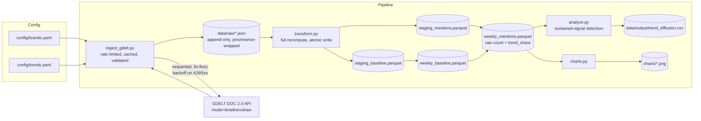
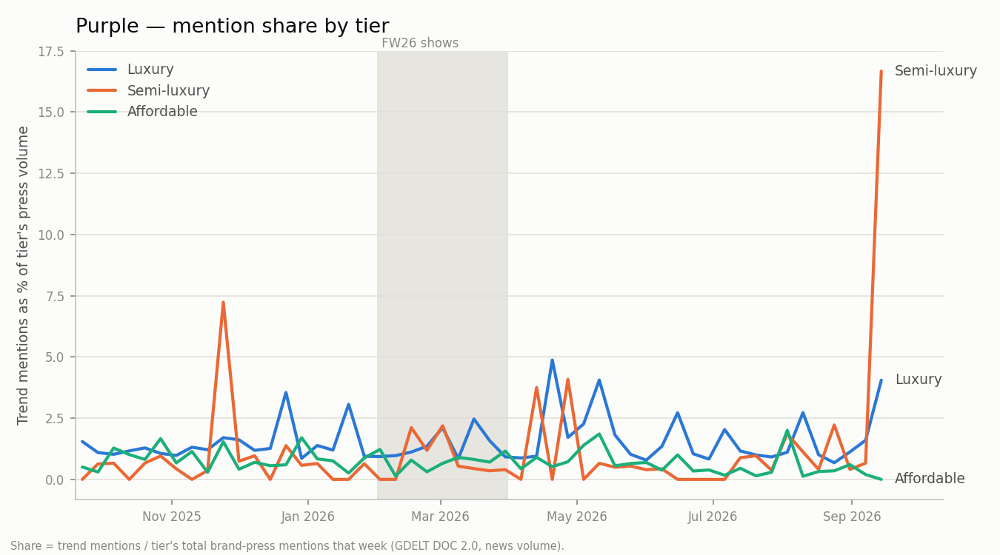
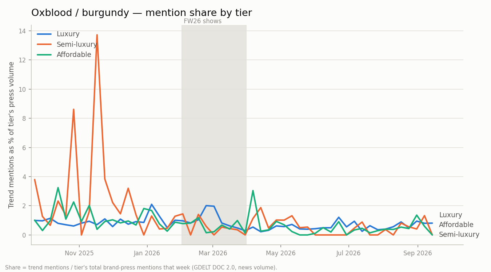
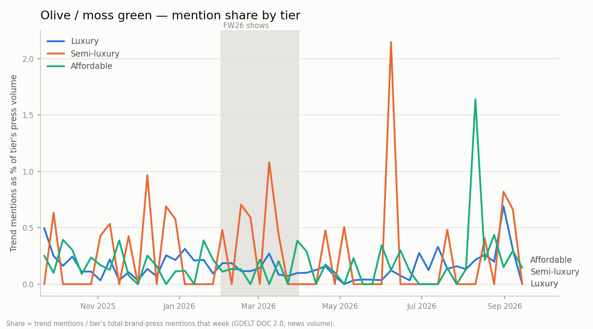

# Trickle-Down Trend Tracker

A fashion trend diffusion engine. **Hypothesis:** luxury houses set trends on the runway
(Fall/Winter 2026 shows, Feb–Mar 2026); semi-luxury brands adapt them next; affordable brands
mass-produce them last. This project measures that lag using public news coverage as a proxy
for trend momentum — not sales data, not social media, just how much the press is talking about
a given trend in the context of a given brand tier, and how many weeks it takes for that
attention to move from one tier to the next.

## Architecture



Three layers, kept structurally separate:
- **raw** (`data/raw/`) — exactly what GDELT returned, wrapped with fetch provenance. Append-only;
  a cache file is never rewritten in place.
- **staging** (`data/staging/`) — typed, normalized rows: one per `(trend_id | tier, date)`.
- **mart** (`data/marts/`) — weekly aggregates, joined into `trend_share` (see below).

`transform.py` fully recomputes staging and both marts from whatever is currently in `data/raw/`
on every run, and writes atomically (temp file + rename). Nothing is ever appended to an existing
output, so a rerun cannot create duplicates — that guarantee holds by construction, not by a
dedup step.

## Data sources & legal notes

The only external data source is the [GDELT DOC 2.0 API](https://blog.gdeltproject.org/gdelt-doc-2-0-api-debuts/),
specifically `mode=timelinevolraw`: **daily article counts** matching a boolean keyword query,
plus `norm` (total articles GDELT monitored that day, for normalization). This endpoint returns
**counts only** — no headlines, no URLs, no article text. This project never calls GDELT's
article-list endpoint, so no copyrighted article content is ever fetched or stored; `data/raw/`
contains nothing beyond aggregate mention counts and the query that produced them.

Two things learned by hitting the live API directly (not documented in GDELT's own docs):

1. **`Parentheses may only be used around OR'd statements.`** A single search term must be bare;
   only a group of 2+ terms joined by `OR` may be wrapped in `()`.
2. **A bare term with a "special" character is rejected as an "illegal character."** A bare
   `H&M` failed; GDELT's own error message says to quote it instead (its example is a dash,
   `"f-16"`). `query_builder.py` quotes any term that isn't plain alphanumeric, not just
   multi-word phrases.
3. **Rate limit, stated by the API itself:** *"Please limit requests to one every 5 seconds."*
   This came back as plain text, sometimes under HTTP 429, sometimes under HTTP 200 — so the
   client never trusts status codes alone; every response body is parsed and schema-validated
   regardless of status. In practice, under sustained use, the *effective* throttling was
   noticeably stricter than that stated floor — individual requests sometimes needed several
   minutes of retrying, and the pipeline hit what looked like an extended soft-block on one IP
   during heavy testing (a different network cleared it immediately). `ingest_gdelt.py` is
   written assuming this will happen again: it fails fast per-request (`MAX_RETRIES=3`, capped
   backoff) rather than retrying forever, stops the whole run after
   `MAX_CONSECUTIVE_TASK_FAILURES` (default 3) failures in a row, and is fully resumable — the
   raw cache is durable, so a rerun only fetches what's still missing and reports a cached/
   fetched/failed summary at the end.

## Design decisions & trade-offs

**Normalize by tier baseline, not raw counts.** Luxury houses (Chanel, Hermès) get structurally
more press than affordable brands (Mango, Uniqlo) regardless of any specific trend — so raw
mention counts would make luxury look like the first mover for *every* trend, by construction.
Three baseline queries (brands OR'd, no trend terms) are fetched per tier, and every trend's
weekly mentions are expressed as `trend_share = trend_mentions / tier_baseline_mentions`. All
signal detection, lag calculation, and charts run on `trend_share`; raw `mention_count` stays in
`weekly_mentions.parquet` for reference.

**Sustained signal, not a fixed volume threshold.** A single viral article shouldn't be able to
mark a trend as "emerged." Per `(trend, tier)`, a week counts as `elevated` only if its 3-week
rolling mean share exceeds the trailing 8-week median share by 2x (`SIGNAL_FACTOR`, in
`src/config.py`), and `first_signal_week` requires 2 consecutive (`SUSTAINED_WEEKS`) elevated
weeks. One caveat this produces: if an elevated period runs long enough (several weeks), the
trailing median itself eventually rises to include those elevated weeks, and the plateau can stop
being flagged as "elevated" even though coverage hasn't dropped — the algorithm is tuned to catch
the *onset* of a breakout, not to track every week of a long-sustained trend. `peak_week` is
therefore the max-share week among weeks the algorithm *did* flag as elevated (ties broken by the
earliest such week), which can under-represent a true peak that arrives late in a long plateau.

**Ambiguous brand names get a disambiguating `search_term`.** "Theory", "Reformation", "COS", and
"Mango" are common words/acronyms that would pull in unrelated news under a bare-name query.
`config/brands.yaml` lets a brand entry be `{name, search_term}` instead of a plain string (e.g.
`Theory` → `"Theory clothing"`); `search_term` defaults to `name` when not given. This is a
precision-over-recall call: some true-positive mentions that don't happen to include the
disambiguating word are lost, in exchange for far less noise. **"The Row" stays unresolved** — no
good disambiguating term exists for it without meaningfully hurting recall, so it's a known,
documented source of noise in the luxury baseline and any trend involving that brand.

**Full-recompute idempotency over incremental upsert.** `transform.py` always rebuilds staging
and both marts from the entire `data/raw/` directory rather than merging new rows into existing
parquet files. Simpler than upsert/merge logic, and correct at this data scale (14 trends × 3
tiers + 3 baselines = 45 raw files).

**Provenance on every row.** Each raw cache file wraps the GDELT response with `query`,
`timespan`, `url`, and `fetched_at` (UTC). `fetched_at` is written once, at actual fetch time, and
carried through unchanged as `ingested_at` on every staging row sourced from that file —
`transform.py` never stamps `datetime.now()` itself, since doing so would make two runs over
identical raw inputs produce different output and break the idempotency guarantee.

## Limitations

- **Fashion-week weeks inflate luxury coverage regardless of trend.** Feb–Mar 2026 (the FW26 show
  season) is a spike in luxury press volume across the board — including for brands/trends that
  have nothing to do with a given query. Baseline normalization (`trend_share`) mitigates this
  (a trend's share of *that week's* elevated luxury coverage, not raw counts), but doesn't
  eliminate it entirely; charts shade the FW26 show window for this reason.
- **News volume measures press attention, not product adoption.** A trend "reaching" the
  affordable tier here means affordable-brand press started mentioning it — not that affordable
  retailers actually shipped the product. That's exactly the gap the Shopify `/products.json` step
  below is meant to close.
- **"The Row" brand-name collision** (see above) is a known, unresolved noise source.
- **No documented GDELT query-length cap** was found; the luxury brand OR-block alone runs
  ~160 characters. Not pre-building query-chunking for a limit that isn't confirmed to exist — if
  it surfaces, the client's fail-loud JSON validation will point at the exact `(trend, tier)` pair
  responsible.

## How to run

```bash
python3 -m venv .venv && source .venv/bin/activate
pip install -r requirements.txt

make ingest      # fetch + cache all 45 GDELT queries (sequential, ~5s/request minimum)
make transform   # raw -> staging -> weekly marts (idempotent, full recompute)
make analyze     # weekly marts -> data/output/trend_diffusion.csv
make charts      # weekly marts -> charts/*.png (3 tier lines per trend)
make all         # the above four, in order
make test        # pytest -- all synthetic fixtures, no network calls

make agent Q="'which trends reached the affordable tier fastest?'"   # ask the marts
make eval        # agent eval suite (needs ANTHROPIC_API_KEY)
make eval-dry    # print eval cases + ground truth, no API calls
```

Each module is also runnable standalone, e.g. `python -m src.ingest_gdelt` (optionally
`python -m src.ingest_gdelt 5` to run only the first 5 tasks — useful for a smoke test before
committing to the full 45-query, rate-limited sweep).

## Query agent

A natural-language layer over the finished marts: ask a question, get an answer
grounded in a SQL query it actually ran.

```bash
make agent Q="'what is the lag for suede?'"
```

**DuckDB reads the parquet marts directly** — `weekly_mentions`, `weekly_baseline`, and
`trend_diffusion` are registered as views over the files the pipeline already produced. The agent
has no network path to GDELT at all: `src/agent_db.py` is its only data access, and it reads local
files and nothing else, so a question can never trigger a fetch or cost an API quota.

**The SQL guardrail parses, it doesn't pattern-match.** Candidate SQL goes through DuckDB's own
parser (`json_serialize_sql`) and must come back as exactly one `SELECT`. Stacked statements
(`SELECT 1; DROP TABLE ...`), DDL, and DML fail to parse at all. A second layer rejects
filesystem-reaching table functions (`read_csv`, `read_parquet`, `glob`), which would otherwise be
valid SELECTs. Every query is logged to `data/output/agent_queries.jsonl` with its question, row
count, duration, and any error.

Two behaviours are the actual point, and both are asserted in the eval suite rather than just
described in the prompt:

- **It refuses past its data.** Coverage is computed from the marts at startup and injected into
  the system prompt, because an empty result set is indistinguishable from a real zero unless you
  already know that tier was never ingested. Asked about a trend missing a tier, it names the
  missing tier and declines to give a lag — `trend_diffusion` still has a row for such trends, and
  those values are artefacts of missing data, not findings.
- **It describes the metric honestly.** This measures press coverage volume, so the agent says
  "press momentum" or "media attention" and never "best selling", "sell-through", or a bare
  "trending". Asked a sell-through question outright, it says the dataset cannot answer it instead
  of substituting press volume.

`make eval` runs the suite: fixed questions, with the expected values computed from the marts by
ground-truth SQL at run time rather than pasted in as literals, since incremental ingest would rot
hard-coded numbers into false failures. `make eval-dry` prints the cases and their ground truth
without spending any tokens.

## Findings

**Coverage is now 13 of 14 trends (44 of 45 queries cached).** Only `le_smoking` is still
incomplete, missing its `affordable` tier — GDELT returned HTTP 429 on that one query after four
attempts. Rerunning `make ingest` resumes from cache and retries only what's missing.

> **The table and analysis below were written against an earlier 7-trend subset and have not been
> regenerated.** The six trends that filled in since (`equestrian`, `leopard`, `plaid`, `brooch`,
> `velvet`, `sheer_layering`) all classify as `mass`, and they do **not** reproduce the
> semi→affordable pattern described below: across all 11 trends that now have a semi→affordable
> lag, 5 are negative and 6 positive, ranging −10 to +36. The luxury→semi finding, by contrast,
> holds and strengthens — 6 of 9 lags are negative. See `data/output/trend_diffusion.csv` for the
> current numbers; the prose below is kept as written rather than quietly restated.

Of the 7 complete trends, all but `suede` and `shearling_texture` classify as `mass` — trend
mentions reached a sustained, elevated share of press for all three tiers within the 12-month
window:

| trend | classification | lag luxury→semi (weeks) | lag semi→affordable (weeks) |
|---|---|---|---|
| `purple` | mass | — (no luxury breakout detected) | **+36** |
| `oxblood` | mass | — (no luxury breakout detected) | **+20** |
| `olive_moss` | mass | −6 | **+28** |
| `statement_fur` | mass | −10 | **+8** |
| `skirt_suit` | mass | **+3** | −10 |
| `suede` | spreading | — | (no affordable signal yet) |
| `shearling_texture` | spreading | −13 | (no affordable signal yet) |

Two honest reads of this, not one clean story:

- **The semi→affordable lag is consistently large and positive** (8–36 weeks) across every trend
  that reached `mass`. That's the strongest signal in the data, and it's in the direction the
  hypothesis predicts — semi-luxury press attention shows up well before affordable press
  attention does.
- **The luxury→semi lag is inconsistent, and mostly *not* in the predicted direction** — negative
  (semi-luxury signal arrived *before* luxury's) for 3 of 5 `mass` trends, and undetected
  entirely for 2 more. Read at face value this would say semi-luxury sometimes leads, not
  follows. I don't think that's the real story; more likely explanations, in order of how much I
  trust them: (1) `purple` and `oxblood` had real luxury runway coverage concentrated right at
  FW26 (Feb–Mar 2026) that may already have been "priced in" to luxury's baseline by the time the
  12-month window's trailing-median comparison kicks in, so the algorithm sees no fresh
  breakout even though the trend is genuinely luxury-led (a real limitation of a rolling
  same-series baseline, not evidence semi-luxury led); (2) the partial-ingest gaps (Sept 2025 data
  missing for some tiers) could distort which week reads as "first"; (3) it's possible some of
  this is real — semi-luxury brands with faster design cycles picking up on pre-show trend
  reporting (fabric/color forecasting coverage) before the runway shows themselves land in
  luxury-brand-specific press. Distinguishing these needs the full 45-query dataset and probably
  a second season to compare against, not more staring at this one.

Take the specific week-counts as directional, not precise — see Limitations above, especially the
GDELT-news-volume-as-proxy and FW26-inflates-luxury-coverage caveats.

### The semi-luxury → affordable lag, in charts

The three trends with the widest, cleanest semi-luxury → affordable gaps (`charts/` has all 14;
these three are copied into `docs/` so they render here without needing `data/` regenerated):


`purple`: semi-luxury's Nov 2025 spike (7% share) is the dominant feature at this scale, which
flattens affordable's own real-but-much-smaller breakout in Aug 2026 into something that looks
flat by eye — the algorithm catches it (relative to affordable's own quiet baseline) even though
the chart doesn't make it obvious; the widest gap observed, ~36 weeks.


`oxblood`: a sharp semi-luxury spike in late 2025 (twice, up to 14% share) with affordable's own
visible breakout (a clear ~3% spike) not arriving until spring 2026, ~20 weeks later — the
cleanest visual case of the three.


`olive_moss`: semi-luxury spikes repeatedly through the FW26 window and peaks in June 2026, then
affordable has its own clear spike in August 2026, roughly 28 weeks after semi-luxury's first
sustained signal.

See `data/output/trend_diffusion.csv` for all 14 trends (including the 7 partial ones, which
mostly land as `spreading`/`emerging`/`no_signal` simply for lack of data) and `charts/*.png` for
the full weekly curves.

## Next steps

- **Shopify `/products.json` catalogs** — query affordable/semi-luxury retailers' public product
  catalogs directly to measure *actual product listings*, not just press mentions. This is the
  real fix for the "press attention vs. product adoption" gap noted above.
- **LLM trend extraction from runway coverage** — replace the hand-curated `trends.yaml` with an
  LLM pass over runway review articles, so new seasons don't require manually re-deriving trend
  terms and evidence.
- **BigQuery + Dataform** — move the mart layer into BigQuery with Dataform-managed
  transformations, for a real warehouse instead of local parquet, and to make this pipeline
  trivially schedulable.
- **Dashboard** — a small Looker Studio / Streamlit view over `trend_diffusion.csv` and the
  weekly marts, so the diffusion lag per trend is browsable rather than a static CSV + PNGs.
